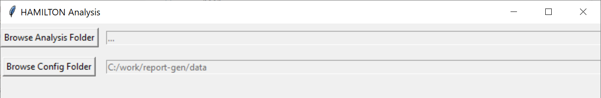

# ELISA Report Generation

Python project for automatic report generation from Hamilton measurements.

## Prerequisities

To install python libraries use

```bash
pip install -r requirements.txt
```

Install `pandoc` frpm [pandoc](https://pandoc.org/installing.html) website.  

Install `latex` from any of the [distributions](https://www.latex-project.org/get/#tex-distributions).  

## Buld distribution of `elisarep`

For experts only.  
To build a hemrep library execute following command:

```bash
python -m build --sdist --wheel
```

## Running the script

```bash
python .\report_gen.py --help

usage: report_gen.py [-h] [--analysis ANALYSIS] [--cfg CFG]
                     [--ifld IFLD]

options:
  -h, --help           show this help message and exit
  --analysis ANALYSIS  analysis directory
  --cfg CFG            config and params directory
  --ifld IFLD          initial analysis folder
```

`--cgf` is path to the configuration directory.  
`--ifld` set an initial folder where GUI analysis folder shall open at start.  

  

`--analysis` is path to a folder with finished Hamilton analysis, e.g. `C:/work/hamilton/230801_AAV9-ELISA_sey_GN004240-053`  
If analysis directory is not given, GUI window opens to select the diectory.  
**Analysis folder name is parsed to retrieve certain analysis information!**  
The structume shall be `[DATE]_[METHOD]_[USER]_[GN]`, where the fields are separated by underscore character `_`  
where  
`[DATE]` is a date in format `%y%m%d` (*230801*)  
`[GN]` is analysis identifier (*GN004240-033*)  
`[PROTOCOL]` is a protocol name (*AAV9-ELISA*)  
`[USER]` is user name/code (*sey*)

The working directory **must** contain following files in given format:  

- `[DATE]_[GN]_-_worklist-ELISA.xls`
- `[DATE]_[GN]_-_[PROTOCOL]_Parameters.csv`

Examples:  
`230426_GN004240-033_-_worklist-ELISA.xls`  
`230426_GN004240-033_-_AAV9-ELISA_Parameters.csv`

### Config file `config.json`

Command line argument is used to define a folder containing configuration file, and other files necessary to execute `report_gen.py` programm.  

```bash
python report_gen.py --cfg ./data
```

**Important: if relative path is used for `--cfg` argument, the path is relative to the current execution/working directory!**  
To make sure intended folder path is used, provide absolute path.

```bash
python report_gen.py --cfg C:/work/elisa-report/data
```

Configuration file `config.json` is a json format file containing configurable parameters. It could be located in either default folder `./data` or in local analysis folder. If the file is located in the **analysis** folder it has precedence (is meant to be modified by a user). Though, if the config file is not found in analysis folder it is read from the default location in the `./data` folder.  
`referenceValue` is identified automatically from the analysis folder name (see above). If the analysis folder name contains a string `AAV8` or `AAV9` reference value for given `AAV*` is used, otherwise an exception is thrown.

Validity limits are defined for AAV9 or AAV8. Test validity is checked according to 3σ limits. Control result shall lie within interval <`limits[0]`, `limits[1]`>.  Default limits should not be used, and are defined so that the `report_gen` doesn't thow exception (fail).  

The file shall contain entries listed below.

```json
{
    "pandoc_bin": "c:/work/pandoc/pandoc",
    "pdflatex_bin": "c:/Users/hwn6193/AppData/Local/Programs/MiKTeX/miktex/bin/x64/pdflatex",
    "reference_docx": "custom-reference.docx",
    "plate_layout_id": "plate_layout_ident.csv",
    "plate_layout_num": "plate_layout_num.csv",
    "plate_layout_dil_id": "plate_layout_dil_id.csv",
    "numeric_warning_disable": true,
    "AAV9": {
        "SOP": "SOP-234702",
        "MHF": "DMD-211328",
        "referenceValue": 1.7954e+10,
        "limits": [
            1.888E+12,
            2.703E+12
        ]
    },
    "AAV8": {
        "SOP": "SOP-236462",
        "MHF": "DMD-211877",
        "referenceValue": 2.1167E+10,
        "limits": [
            1.119E+11,
            1.648E+11
        ]
    },
    "default": {
        "referenceValue": 1.0E+10,
        "limits": [
            1.0E+10,
            1.0E+12
        ]
    },
    "dilutions": [
        1.0,
        2.0,
        4.0,
        8.0,
        16.0,
        32.0,
        64.0
    ]
}
```

### Running with exported photometer `txt` data

This is a prefered way to run the preocessing of the results and following report generation.  
`--cfg` argument is a path of config directory, containing `params.json`, layout `*.csv` files, `custom-reference.docx` and `params.json`

```bash
python report_gen.py DIR_NAME --cfg ./data
```

## HAMILTON

To export data in **TXT** format run the *SoftMax Pro* softare, and open given analysis. From the main menu choose 'Export' and select the `Export to XML XLS TXT` option.  


**Export measurements for all plates.**  

**Make sure the exported file name matches the folder name structure!**  
folder name example `230922_AAV9-ELISA_fff_GN004360-086`  
corresponding file name example `230922_AAV9-ELISA_1_20230922_103137.txt`  

Folder with Hamilton related stuff.

[Hamilton](<C:\Users\hwn6193\OneDrive - Takeda\2 Geräte\Hamilton_System>)

## Profiling

Define profiling in `launch.json` in VS Code:  

```json
{
    "name": "profiler",
    "type": "python",
    "request": "launch",
    "module": "cProfile",
    "args": [
        "-o",
        "./.tmp/tmp.prof",
        "report_gen.py",
        "--analysis",
        "c:/work/hamilton/analysis/231213_AAV9-ELISA_sey_GN004240-068",
        "--cfg",
        "C:/work/elisa-report/data"
    ]
}
```

Run the profing server... (make su snakeviz is installed `pip install snakeviz`)  

```bash
python -m snakeviz .tmp/tmp.prof --server
```
