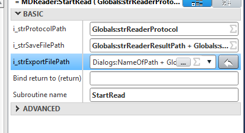

# Overview Hamilton Method  (Sebastian Information Writedown)

## Takeda_WL_ELISA

XSL Workflow

Main Script to start performing the Hamilton ELISA method.

Assay Dialog:
Number of Assays <= 4 \
This is the number of Takeda_LL_ELISA Scripts that will be started.\
Each Assay starts its own WorklistDialog and needs its own Parameter and Worklist File.

## Takeda_LL_ELISA

XSL Assay

Contains all information for the practical operations on the robot. Contains the information how the test is run for up to 4 plates.
(4 plates times 4 Assays = 16 plates total)

## Takeda_EL_WorklistHandling

XSL Library

    Excel File Converter
    Converts Sample Name and Dilution in the Worklist File into strings & Viscosity into a boolean.
    Header of each row must be present: 
    SampleID_1 | Dilution_1 | Viscosity_1 | SampleID_2 | Dilution_2 | Viscosity_2 | SampleID_3 | Dilution_3 | Viscosity_3 | SampleID_4 | Dilution_4 | Viscosity_4

## Takeda_EL_WorklistDialog

Custom Dialog Window

    Builds Window for the Dialog for the Filepaths of the Parameter and Worklist file.

## Takeda_EL_Utility

XSL Library

Contains the pre-defined dilutions that can be chosen in the Worklist. Volume as [µL] for Buffer and Sample. e.g.: 1:2 Dilution = 125µL Buffer + 125µL Sample
Sample & Buffer 1 = Second Dilution step if multiple
Sample & Buffer 2 = First Dilution step, if single diluton step "0"µL

    Defines the Plate Layout as List. 
    A1=1, A2=2, B1=13, H12=96, etc.

    e.g. Buffer Dispense onto plate: GetListOfWellIndexesMTPBuffer = 
    lstIntResult.AddMany(2,3,4,6,7,8,9,10,11,14,15,16,26,27,28,38,39,40,50,51,52,62,63,64,74,75,76,86,87,88,18,19,20,30,31,32,42,43,44,54,55,56,66,67,68,78,79,80,90,91,92,22,23,24,34,35,36,46,47,48,58,59,60,70,71,72,82,83,84,94,95,96)

## Takeda_EL_TransportController

XSL Library

    Contains All Transport Steps for the different amount of Assays possible.

## Takeda_EL_TransferPatternController

XSL Library

## Takeda_EL_ResourceController

XSL Library

## Takeda_EL_PipettingController

XSL Library

Defines the Pipetting steps for the whole Script:

- Which Liquid Class is used
- Which Pipetting Tips are used
- Error Handling
- Mixing
- Liquid Level Detection (LLD)

## Takeda_EL_PipettingContextController

XSL Library

## Takeda_EL_MDReader_Controller

XSL Library

Defines the Commands for the Photometer (Reader):

- Initialize
- OpenDoor
- CloseDoor
- StartRead
- Terminate
- GetScript
- LoadScript
- ExecuteScript

Same as Scripts that are saved at: [C:\ProgramData\Hamilton\XRP\SoftmaxPro-Scripts]("C:\ProgramData\Hamilton\XRP\SoftmaxPro-Scripts")

If Method is aborted or if the connection to SoftmaxPro Software isn't terminated correctly, a new connection can not be created.
Either the SoftmaxPro is Terminated via Command or the Task is killed via Taskmanager.

## Takeda_EL_Globals

XSL Library

## Takeda_EL_DialogController

XSL Library

Information from the Takeda_EL_WorklistDialog is parsed to variables:

- Worklist File Path
- Parameter File Path

TODO... pls docs :))  

## Skript Implementation

### Takeda_EL_DialogController Changes

    Changes:
        Lines 4,5,6,7
            Variables defined needed to use command .split 
        Lines 25,26,27,28
            After Worklist File Path was loaded, it is split at each \ and then build together with the file name left out
            Variable: NameOfPath

### Takeda_LL_ELISA Changes

    Changes:
        Line 947
            Copied read comand outside of (if simulation) for testing
        Line 949
            Disabled original Read file for maintaining old line, if not working
        Line 999
            Execute Python Skript in Folder defined with String: NameOfPath

Problems:

- Why can he read? Initialisation and everything is still in Simulation and won't trigger??
  - It worked Once(!) when reading in simulation mode, that a .txt file was created and saved, but I couldn't repeat that.
  - Remember to delete Files in SoftmaxProDB to enable reread same file with gxpadmin
- Read Works for Testskript but not in my Takeda_LL_ELISA anymore? why?

MDReader:StartRead

i_strProtocolPath = Path of the Protocol (.sda) Inside the photometer software DB. \
i_strSaveFilePath = Path of Experiment (.sdax) inside the photometer software DB. currently only folder is "ELISA/" \
i_strExportFilePath = Path outside Software, in Windows, where files will be exported and as what defined by the ending (.txt or .xls)

### Current State

- Testing File (230728_TestReaderExportFile) can:
  - Read a plate
  - Save a .txt in a folder
  - execute phyton script in correct folder

- Main File can:
  - execute Phython script in the correct folder
  - can save .txt but not in the correct folder with the variable NameOfPath
    - can save as .txt when using the default path (in Globals: strReaderResultExportPath = "C:\\Data\\Experiments\\")
    - Does not read when using "NameOfPath" Variable --> I don't know why :(

Big To Do: \
    Find out how to export the Photometer File automatically into the working directory... if even possible with current MDReader skripts
    Then implement that function in Takeda_EL_ELISA
