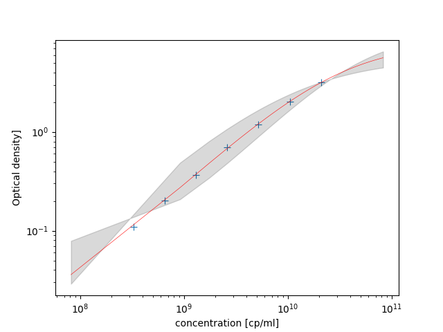

# Automatically Generated Markdown report

This a PoC for automatic report generation...  

## Header

Date: 231705

Ientification: GN004240-033

Comment: TODO...

## Analysis Results

| Sample type   | Sample Name               |   Pre-dilution |   Reader Data [cp/ml] |   Result [cp/ml] |    CV [%] |
|:--------------|:--------------------------|---------------:|----------------------:|-----------------:|----------:|
| control 01    | Kontrolle01               |              1 |           1.94581e+10 |      1.94581e+10 |   1.21412 |
| reference 01  | Referenz01                |              1 |           2.0883e+10  |      2.0883e+10  |   1.25642 |
| sample 01     | EHU04_2311_AAV9_FT1       |             10 |           1.35831e+10 |      1.35831e+11 |   2.10119 |
| sample 02     | EHU04_2311_AAV9_FT2       |             10 |           8.36919e+09 |      8.36919e+10 |   3.86403 |
| sample 03     | EHU04_2311_AAV9_FT3       |             10 |           4.44895e+09 |      4.44895e+10 |   3.07784 |
| sample 04     | EHU04_2311_AAV9_W1        |             10 |           2.67225e+08 |      2.67225e+09 |   7.23745 |
| sample 05     | EHU04_2311_AAV9_E2        |           1000 |           3.33313e+09 |      3.33313e+12 |   6.54286 |
| sample 06     | EHU04_2311_AAV9_E1+E3     |             50 |           2.68553e+09 |      1.34277e+11 |   3.02315 |
| sample 07     | EHU04_2311_AAV9_E_DIL     |           1000 |           2.81493e+09 |      2.81493e+12 |   4.63554 |
| sample 08     | EHU04_2311_AAV9_Reg2      |             10 |           2.20794e+09 |      2.20794e+10 |   5.70059 |
| sample 09     | EHU04_2311_AAV9_Reg4      |             10 |           3.82497e+09 |      3.82497e+10 |   3.68339 |
| sample 10     | EHU04_2311_AAV9_Reg6      |             10 |           6.6915e+09  |      6.6915e+10  |   3.80582 |
| sample 11     | PPO02_2307MUQ_FT          |            100 |           3.68489e+09 |      3.68489e+11 |   2.95516 |
| sample 12     | PPO02_2307AFF_FT          |             10 |           7.55773e+07 |      7.55773e+08 |  35.5052  |
| sample 13     | PPO02_2307AFF_NE          |             10 |           3.22825e+07 |      3.22825e+08 |  73.0673  |
| sample 14     | PPO02_2307AFF_ELU         |           1000 |           1.76866e+07 |      1.76866e+10 |  49.3163  |
| sample 15     | PPO02_2307SDT_F           |            200 |           2.87696e+07 |      5.75392e+09 |  80.0763  |
| sample 16     | PPO02_2307POL_FT          |             10 |           4.55948e+07 |      4.55948e+08 | 125.411   |
| sample 17     | PPO02_2307POL_FLT         |           1000 |           2.38348e+07 |      2.38348e+10 | 123.013   |
| sample 18     | EDP_2313_S02_T03_CT       |             10 |           2.33355e+07 |      2.33355e+08 | 114.397   |
| sample 19     | EDP_2313_S03_T03_CT       |             10 |           3.97058e+07 |      3.97058e+08 | 123.418   |
| sample 20     | EHU04_2312B_UFA_UDR       |            200 |           4.26779e+07 |      8.53558e+09 |  97.5516  |
| sample 21     | EHU04_2312B_UFA_UDR_conc. |            200 |           2.24679e+07 |      4.49358e+09 | 155.871   |

## Reference Curve Fit

$\LARGE x = {d + {a - d \over {1 + ({ x \over c })^b}} }$  

Fit parameters

| Parameter name   |   Estimated value |       Error | Confidence interval   |
|:-----------------|------------------:|------------:|:----------------------|
| a                |        0.00788769 | 0.0188997   | [-0.0523, 0.068]      |
| b                |        0.941942   | 0.0385487   | [0.819, 1.06]         |
| c                |        3.28e+10   | 5.89603e+09 | [1.4e+10, 5.16e+10]   |
| d                |        7.97675    | 0.766813    | [5.54, 10.4]          |

Backfit...

| Well      |   Standard Value [cp/ml] |   Optical density |   Concentration backfit |
|:----------|-------------------------:|------------------:|------------------------:|
| ('A', 5)  |              2.09e+10    |            3.158  |             2.08875e+10 |
| ('A', 6)  |              1.045e+10   |            2.0378 |             1.04931e+10 |
| ('A', 7)  |              5.225e+09   |            1.1946 |             5.15457e+09 |
| ('A', 8)  |              2.6125e+09  |            0.6939 |             2.67096e+09 |
| ('A', 9)  |              1.30625e+09 |            0.3684 |             1.28788e+09 |
| ('A', 10) |              6.53125e+08 |            0.2027 |             6.54879e+08 |
| ('A', 11) |              3.26562e+08 |            0.1096 |             3.24364e+08 |

## Sample evaluation

### Sample: controll 'k' 1

|          |   OD_delta |   plate_layout_dil |   concentration |
|:---------|-----------:|-------------------:|----------------:|
| ('A', 1) |     3.0362 |                  1 |     1.95073e+10 |
| ('A', 2) |     1.9465 |                  2 |     1.96645e+10 |
| ('A', 3) |     1.1445 |                  4 |     1.95421e+10 |
| ('A', 4) |     0.631  |                  8 |     1.91185e+10 |

CV = 1.21 [%]  
mean = 1.946e+10 [cp/ml]

### Sample: sample 's' 1

|          |   OD_delta |   plate_layout_dil |   concentration |
|:---------|-----------:|-------------------:|----------------:|
| ('B', 1) |     2.459  |                  1 |     1.38597e+10 |
| ('B', 2) |     1.4489 |                  2 |     1.31936e+10 |
| ('B', 3) |     0.8489 |                  4 |     1.35697e+10 |
| ('B', 4) |     0.4732 |                  8 |     1.37093e+10 |

CV = 2.1 [%]  
mean = 1.358e+10 [cp/ml]

### Sample: sample 's' 2

|          |   OD_delta |   plate_layout_dil |   concentration |
|:---------|-----------:|-------------------:|----------------:|
| ('C', 1) |     1.795  |                  1 |     8.78406e+09 |
| ('C', 2) |     0.9791 |                  2 |     8.06129e+09 |
| ('C', 3) |     0.5513 |                  4 |     8.17235e+09 |
| ('C', 4) |     0.3096 |                  8 |     8.45905e+09 |

CV = 3.86 [%]  
mean = 8.369e+09 [cp/ml]

### Sample: sample 's' 3

|          |   OD_delta |   plate_layout_dil |   concentration |
|:---------|-----------:|-------------------:|----------------:|
| ('D', 1) |     1.1006 |                  1 |     4.65369e+09 |
| ('D', 2) |     0.5858 |                  2 |     4.38374e+09 |
| ('D', 3) |     0.3201 |                  4 |     4.39234e+09 |
| ('D', 4) |     0.1726 |                  8 |     4.36603e+09 |

CV = 3.08 [%]  
mean = 4.449e+09 [cp/ml]

### Sample: sample 's' 4

|          |   OD_delta |   plate_layout_dil |   concentration |
|:---------|-----------:|-------------------:|----------------:|
| ('E', 1) |     0.1012 |                  1 |     2.95665e+08 |
| ('E', 2) |     0.05   |                  2 |     2.52356e+08 |
| ('E', 3) |     0.0305 |                  4 |     2.60137e+08 |
| ('E', 4) |     0.0197 |                  8 |     2.60743e+08 |

CV = 7.24 [%]  
mean = 2.672e+08 [cp/ml]

### Sample: sample 's' 5

|          |   OD_delta |   plate_layout_dil |   concentration |
|:---------|-----------:|-------------------:|----------------:|
| ('F', 1) |     0.8959 |                  1 |     3.61936e+09 |
| ('F', 2) |     0.4341 |                  2 |     3.1052e+09  |
| ('F', 3) |     0.2449 |                  4 |     3.2444e+09  |
| ('F', 4) |     0.1373 |                  8 |     3.36356e+09 |

CV = 6.54 [%]  
mean = 3.333e+09 [cp/ml]

### Sample: sample 's' 6

|          |   OD_delta |   plate_layout_dil |   concentration |
|:---------|-----------:|-------------------:|----------------:|
| ('G', 1) |     0.7171 |                  1 |     2.77634e+09 |
| ('G', 2) |     0.3852 |                  2 |     2.70971e+09 |
| ('G', 3) |     0.2001 |                  4 |     2.5815e+09  |
| ('G', 4) |     0.1125 |                  8 |     2.67458e+09 |

CV = 3.02 [%]  
mean = 2.686e+09 [cp/ml]

### Sample: sample 's' 7

|          |   OD_delta |   plate_layout_dil |   concentration |
|:---------|-----------:|-------------------:|----------------:|
| ('H', 1) |     0.7485 |                  1 |     2.92043e+09 |
| ('H', 2) |     0.3758 |                  2 |     2.63464e+09 |
| ('H', 3) |     0.2218 |                  4 |     2.90054e+09 |
| ('H', 4) |     0.1172 |                  8 |     2.8041e+09  |

CV = 4.64 [%]  
mean = 2.815e+09 [cp/ml]

### Sample: sample 's' 8

|          |   OD_delta |   plate_layout_dil |   concentration |
|:---------|-----------:|-------------------:|----------------:|
| ('B', 5) |     0.6261 |                  1 |     2.36818e+09 |
| ('B', 6) |     0.308  |                  2 |     2.10239e+09 |
| ('B', 7) |     0.1677 |                  4 |     2.11272e+09 |
| ('B', 8) |     0.0969 |                  8 |     2.24846e+09 |

CV = 5.7 [%]  
mean = 2.208e+09 [cp/ml]

### Sample: sample 's' 9

|          |   OD_delta |   plate_layout_dil |   concentration |
|:---------|-----------:|-------------------:|----------------:|
| ('C', 5) |     0.9668 |                  1 |     3.96907e+09 |
| ('C', 6) |     0.5012 |                  2 |     3.66117e+09 |
| ('C', 7) |     0.2789 |                  4 |     3.75814e+09 |
| ('C', 8) |     0.1567 |                  8 |     3.9115e+09  |

CV = 3.68 [%]  
mean = 3.825e+09 [cp/ml]

### Sample: sample 's' 10

|          |   OD_delta |   plate_layout_dil |   concentration |
|:---------|-----------:|-------------------:|----------------:|
| ('D', 5) |     1.5097 |                  1 |     6.96147e+09 |
| ('D', 6) |     0.8075 |                  2 |     6.39139e+09 |
| ('D', 7) |     0.4718 |                  4 |     6.83139e+09 |
| ('D', 8) |     0.248  |                  8 |     6.58173e+09 |

CV = 3.81 [%]  
mean = 6.691e+09 [cp/ml]

### Sample: sample 's' 11

|          |   OD_delta |   plate_layout_dil |   concentration |
|:---------|-----------:|-------------------:|----------------:|
| ('E', 5) |     0.9412 |                  1 |     3.84177e+09 |
| ('E', 6) |     0.5027 |                  2 |     3.67377e+09 |
| ('E', 7) |     0.2686 |                  4 |     3.60157e+09 |
| ('E', 8) |     0.1465 |                  8 |     3.62247e+09 |

CV = 2.96 [%]  
mean = 3.685e+09 [cp/ml]

### Sample: sample 's' 12

|          |   OD_delta |   plate_layout_dil |   concentration |
|:---------|-----------:|-------------------:|----------------:|
| ('F', 5) |     0.0268 |                  1 |     5.37704e+07 |
| ('F', 6) |     0.0182 |                  2 |     5.64225e+07 |
| ('F', 7) |     0.0154 |                  4 |     8.05856e+07 |
| ('F', 8) |     0.0132 |                  8 |     1.11531e+08 |

CV = 35.5 [%]  
mean = 7.558e+07 [cp/ml]

### Sample: sample 's' 13

|          |   OD_delta |   plate_layout_dil |   concentration |
|:---------|-----------:|-------------------:|----------------:|
| ('G', 5) |     0.0127 |                  1 |     1.25516e+07 |
| ('G', 6) |     0.0109 |                  2 |     1.52627e+07 |
| ('G', 7) |     0.0116 |                  4 |     3.81101e+07 |
| ('G', 8) |     0.011  |                  8 |     6.32055e+07 |

CV = 73.1 [%]  
mean = 3.228e+07 [cp/ml]

### Sample: sample 's' 14

|          |   OD_delta |   plate_layout_dil |   concentration |
|:---------|-----------:|-------------------:|----------------:|
| ('H', 5) |     0.0107 |                  1 |     7.09438e+06 |
| ('H', 6) |     0.0107 |                  2 |     1.41888e+07 |
| ('H', 7) |     0.0105 |                  4 |     2.62391e+07 |
| ('H', 8) |     0.0091 |                  8 |     2.32241e+07 |

CV = 49.3 [%]  
mean = 1.769e+07 [cp/ml]

### Sample: sample 's' 15

|           |   OD_delta |   plate_layout_dil |   concentration |
|:----------|-----------:|-------------------:|----------------:|
| ('B', 9)  |     0.0105 |                  1 |     6.55979e+06 |
| ('B', 10) |     0.0106 |                  2 |     1.36536e+07 |
| ('B', 11) |     0.0116 |                  4 |     3.81101e+07 |
| ('B', 12) |     0.0107 |                  8 |     5.6755e+07  |

CV = 80.1 [%]  
mean = 2.877e+07 [cp/ml]

### Sample: sample 's' 16

|           |   OD_delta |   plate_layout_dil |   concentration |
|:----------|-----------:|-------------------:|----------------:|
| ('C', 9)  |     0.0099 |                  1 |     4.9721e+06  |
| ('C', 10) |     0.0107 |                  2 |     1.41888e+07 |
| ('C', 11) |     0.0112 |                  4 |     3.37638e+07 |
| ('C', 12) |     0.014  |                  8 |     1.29455e+08 |

CV = 1.25e+02 [%]  
mean = 4.559e+07 [cp/ml]

### Sample: sample 's' 17

|           |   OD_delta |   plate_layout_dil |   concentration |
|:----------|-----------:|-------------------:|----------------:|
| ('D', 9)  |     0.0098 |                  1 |     4.71013e+06 |
| ('D', 10) |     0.01   |                  2 |     1.04698e+07 |
| ('D', 11) |     0.0092 |                  4 |     1.26316e+07 |
| ('D', 12) |     0.0112 |                  8 |     6.75276e+07 |

CV = 1.23e+02 [%]  
mean = 2.383e+07 [cp/ml]

### Sample: sample 's' 18

|           |   OD_delta |   plate_layout_dil |   concentration |
|:----------|-----------:|-------------------:|----------------:|
| ('E', 9)  |     0.0087 |                  1 |     1.89765e+06 |
| ('E', 10) |     0.0094 |                  2 |     7.34245e+06 |
| ('E', 11) |     0.0102 |                  4 |     2.30509e+07 |
| ('E', 12) |     0.0109 |                  8 |     6.10508e+07 |

CV = 1.14e+02 [%]  
mean = 2.334e+07 [cp/ml]

### Sample: sample 's' 19

|           |   OD_delta |   plate_layout_dil |   concentration |
|:----------|-----------:|-------------------:|----------------:|
| ('F', 9)  |     0.0096 |                  1 |     4.18879e+06 |
| ('F', 10) |     0.0106 |                  2 |     1.36536e+07 |
| ('F', 11) |     0.0108 |                  4 |     2.94503e+07 |
| ('F', 12) |     0.0132 |                  8 |     1.11531e+08 |

CV = 1.23e+02 [%]  
mean = 3.971e+07 [cp/ml]

### Sample: sample 's' 20

|           |   OD_delta |   plate_layout_dil |   concentration |
|:----------|-----------:|-------------------:|----------------:|
| ('G', 9)  |     0.0105 |                  1 |     6.55979e+06 |
| ('G', 10) |     0.0116 |                  2 |     1.9055e+07  |
| ('G', 11) |     0.0122 |                  4 |     4.46838e+07 |
| ('G', 12) |     0.0127 |                  8 |     1.00413e+08 |

CV = 97.6 [%]  
mean = 4.268e+07 [cp/ml]

### Sample: sample 's' 21

|           |   OD_delta |   plate_layout_dil |    concentration |
|:----------|-----------:|-------------------:|-----------------:|
| ('H', 9)  |     0.008  |                  1 | 232231           |
| ('H', 10) |     0.0081 |                  2 | 913160           |
| ('H', 11) |     0.0094 |                  4 |      1.46849e+07 |
| ('H', 12) |     0.0115 |                  8 |      7.40412e+07 |

CV = 1.56e+02 [%]  
mean = 2.247e+07 [cp/ml]

